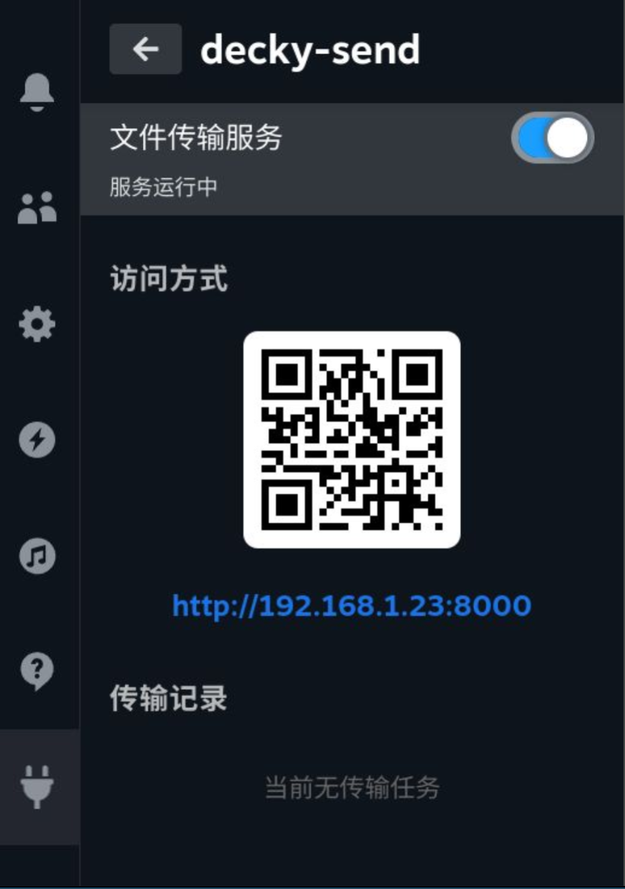
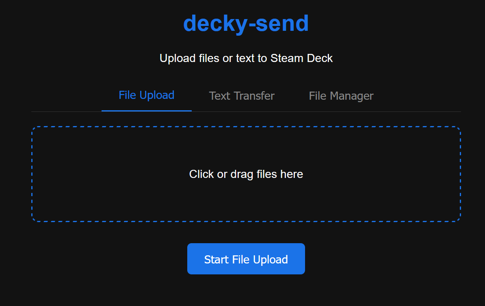
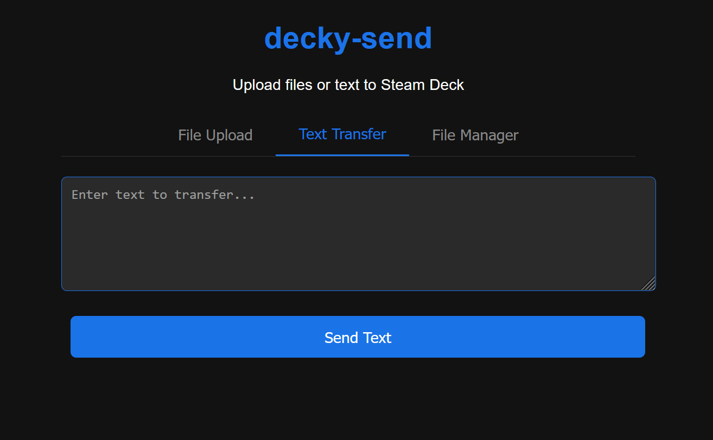
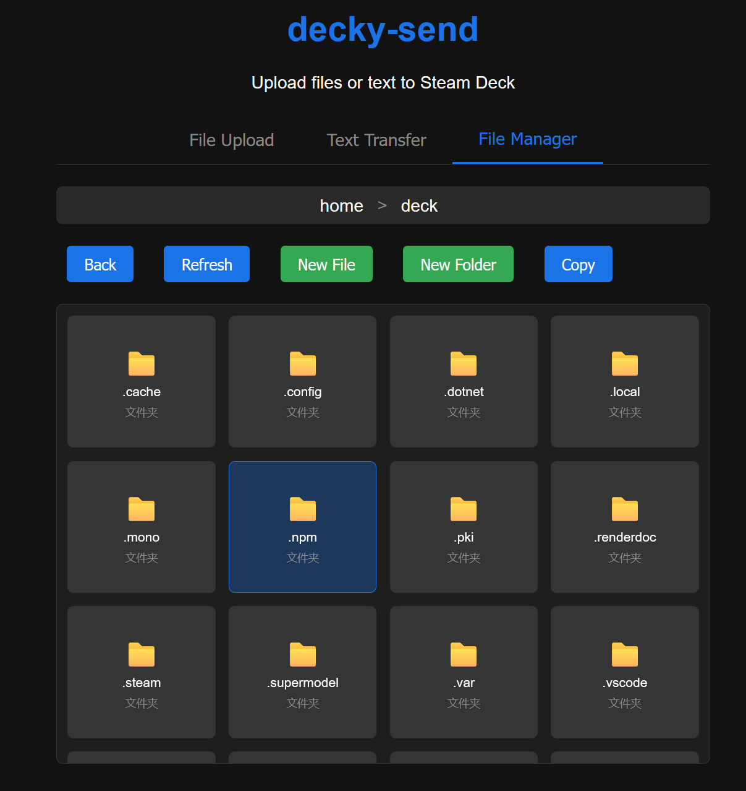

# decky-send - Steam Deck Local Network File Transfer Assistant

A powerful Decky Loader plugin designed to solve the file transfer and management challenges between Steam Deck and other devices. Manage files and sync text easily via browser without data cables.

## Table of Contents

- [Screenshots](#screenshots)
- [Features](#features)
- [Prerequisites](#prerequisites)
- [Installation](#installation)
- [Quick Start](#quick-start)
- [Known Limitations](#known-limitations)
- [Troubleshooting](#troubleshooting)
- [License](#license)
- [Credits](#credits)

## Screenshots

| Plugin Interface | File Transfer |
| :---: | :---: |
|  |  |
| **Text Transfer** | **File Manager** |
|  |  |

## Features

- **Local Network Wireless Transfer** - Easily upload files from mobile or PC to Steam Deck's downloads folder using a browser interface.
- **Text Clipboard Sync** - Solves the inconvenience of typing long text in Steam Deck game mode by sending text directly from phone to Deck clipboard.
- **Web File Manager** - Built-in lightweight file manager to manage Deck files directly in the browser without switching to desktop mode.
- **Scan to Connect** - The plugin automatically generates a QR code, scan with your phone to connect, saying goodbye to tedious IP entry.
- **No Extra Client Needed** - The receiver only needs a modern browser, no app installation required.

## Prerequisites

- Your Steam Deck must have **Decky Loader** installed.
- [Decky Loader Installation Guide](https://github.com/SteamDeckHomebrew/decky-loader)

## Installation

1. Download the latest plugin ZIP file from the [Releases](https://github.com/SteamDeckHomebrew/decky-plugin-template/releases) page.
2. Open the Quick Access Menu (QAM) on Steam Deck.
3. Navigate to Decky -> Settings (gear icon).
4. Enable "Developer Mode" if not already enabled.
5. Click "Install Plugin from ZIP".
6. Navigate to the downloaded ZIP file and select it.
7. The plugin will install automatically.

## Quick Start

1. Open the Quick Access Menu and find **decky-send**.
2. Click to enable the **"File Transfer Service"** toggle.
3. The plugin interface will display a QR code and URL address.
4. Scan the QR code with your phone, or enter the displayed address in your computer browser.
5. **Upload Files**: Click or drag files to the web upload area.
6. **Send Text**: Enter content in the web text box and send, Deck can then copy and use it.
7. **Manage Files**: Click the "File Manager" tab on the web page to perform file operations.

Your files will be saved by default in the Steam Deck's `~/Downloads` folder.

## Known Limitations

- Devices must be connected to the same local network (Wi-Fi).
- File transfer speed is limited by local network bandwidth and router performance.
- Browser must support modern Web standards.
- Resumable upload is not currently supported.

## Troubleshooting

**Cannot access the web page?**
- Confirm that Steam Deck and your device are connected to the same Wi-Fi network.
- Check if Steam Deck is in sleep mode.
- Try turning off and on the plugin's "File Transfer Service" toggle.

**Service failed to start?**
- Port (8000) might be in use, try restarting Steam Deck.
- Check if other services are occupying this port.

**Cannot copy text?**
- Ensure the web page says "Text transfer successful".
- Check if there is a new text notification in the plugin interface.

## License

This project uses the GPL-3.0 License - see the [LICENSE](LICENSE) file for details.

## Credits

- **Decky Loader** - Provided a powerful plugin runtime environment.
- **React Icons** & **QRCode.react** - Provided excellent UI component support.

---

*Disclaimer: This plugin is provided "as is", the author is not responsible for any data loss or damage caused by using this plugin. Please backup important files before operation.*
