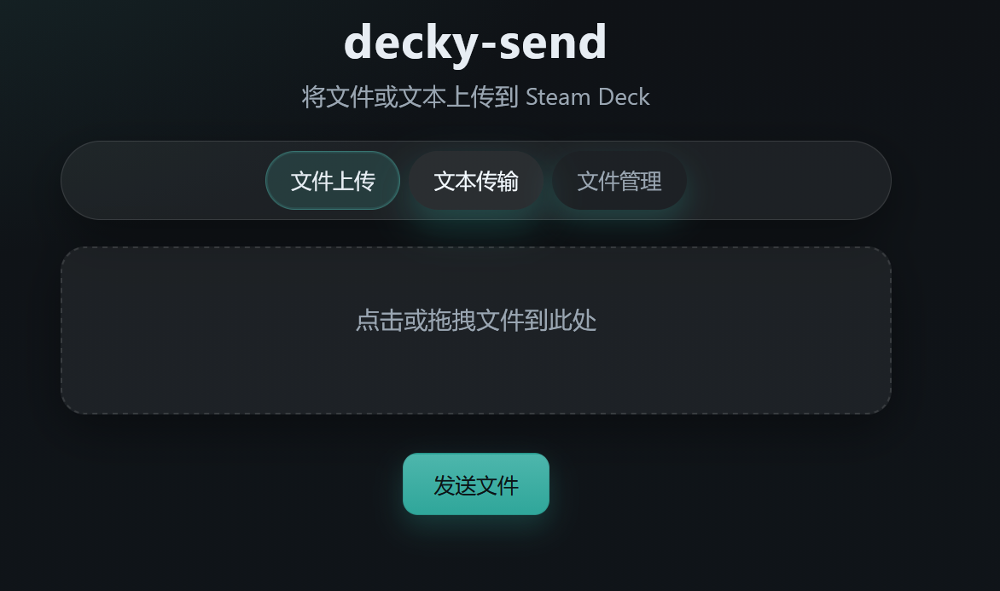
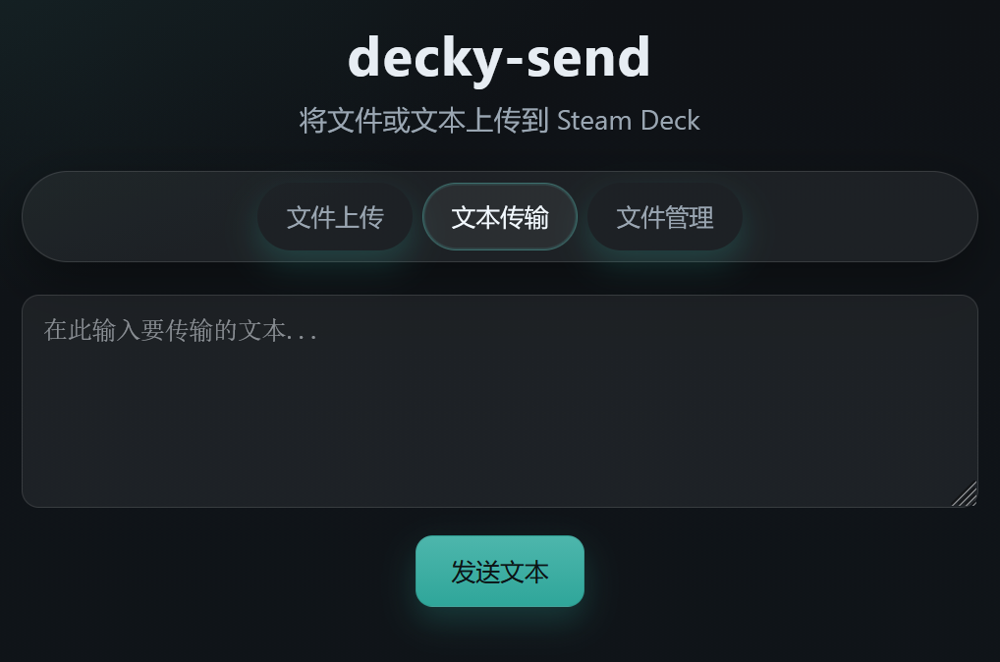
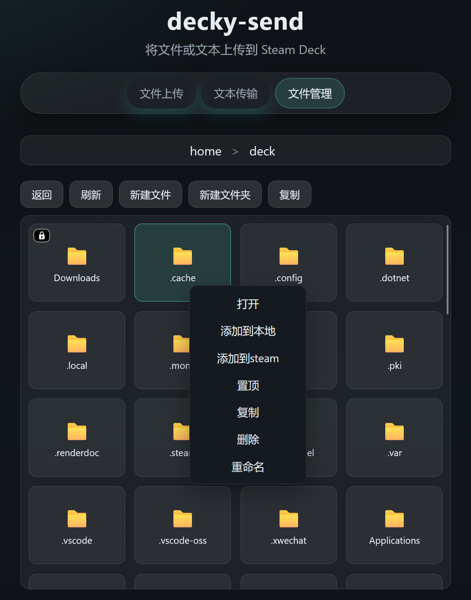

# Decky-send - Steam Deck 文件管理助手

一个功能强大的 Decky Loader 插件，旨在解决 Steam Deck 与其他设备之间的文件传输与管理难题。无需数据线，通过浏览器即可轻松管理文件和同步文本。

## 目录

- [Decky-send - Steam Deck 文件管理助手](#decky-send---steam-deck-文件管理助手)
  - [目录](#目录)
  - [截图预览](#截图预览)
  - [功能特点](#功能特点)
  - [先决条件](#先决条件)
  - [安装指南](#安装指南)
  - [快速开始](#快速开始)
  - [已知限制](#已知限制)
  - [故障排除](#故障排除)
  - [许可证](#许可证)
  - [致谢](#致谢)

## 截图预览

| 插件界面 | 文件传输 |
| :---: | :---: |
|  |  |
| **文本传输** | **文件管理** |
|  |  |

## 功能特点

- **局域网无线传输** - 利用浏览器界面轻松将文件从手机或电脑上传到 Steam Deck 的下载文件夹。
- **文本剪贴板同步** - 解决在 Steam Deck 游戏模式下输入长文本的不便，直接从手机发送文本到 Deck 剪贴板。
- **Web 文件管理器** - 内置轻量级文件管理器，直接在浏览器中管理 Deck 文件，无需切换到桌面模式。支持复制粘贴/下载到本地/添加到steam库/重命名/解压/置顶
- **扫码即连** - 插件自动生成二维码，手机扫一扫即可连接，告别繁琐的 IP 输入。
- **无需额外客户端** - 接收端只需一个现代浏览器，无需安装任何 App。

## 先决条件

- 您的 Steam Deck 必须已安装 **Decky Loader**。
- [Decky Loader 安装指南](https://github.com/SteamDeckHomebrew/decky-loader)

## 安装指南

1. 从 [Releases](https://github.com/SteamDeckHomebrew/decky-plugin-template/releases) 页面下载最新的插件 ZIP 文件。
2. 在 Steam Deck 上打开快速访问菜单 (QAM)。
3. 导航至 Decky -> 设置 (齿轮图标)。
4. 如果尚未启用，请启用“开发者模式”。
5. 点击“从 ZIP 安装插件”。
6. 导航至下载的 ZIP 文件并选择它。
7. 插件将自动安装。

## 快速开始

1. 打开快速访问菜单并找到 **decky-send**。
2. 点击开启 **"文件传输服务"** 开关。
3. 插件界面将显示一个二维码和 URL 地址。
4. 使用手机扫描二维码，或在电脑浏览器输入显示的地址。
5. **上传文件**：点击或拖拽文件到网页上传区域。
6. **发送文本**：在网页文本框输入内容并发送，Deck 端即可复制使用。
7. **管理文件**：点击网页上的“文件管理”标签页进行文件操作。

您的文件默认将保存在 Steam Deck 的 `~/Downloads` 文件夹中。

## 已知限制

- 设备必须连接到同一个局域网 (Wi-Fi)。
- 文件传输速度受限于局域网带宽和路由器性能。
- 浏览器必须支持现代 Web 标准。
- 暂不支持断点续传。

## 故障排除

**无法访问网页？**
- 确认 Steam Deck 和您的设备连接的是同一个 Wi-Fi 网络。
- 检查 Steam Deck 是否处于睡眠模式。
- 尝试关闭并重新开启插件的“文件传输服务”开关。

**服务启动失败？**
- 可能是端口 (59271) 被占用，尝试重启 Steam Deck。
- 检查是否有其他服务占用了该端口。

**无法复制文本？**
- 确保网页端提示“文本传输成功”。
- 在插件界面查看是否有新文本提示。

## 许可证

本项目采用 GPL-3.0 许可证 - 查看 [LICENSE](LICENSE) 文件了解详情

## 致谢

- **Decky Loader** - 提供了强大的插件运行环境。
- **React Icons** & **QRCode.react** - 提供了优秀的 UI 组件支持。

---

*免责声明：本插件按“原样”提供，作者不对因使用本插件导致的数据丢失或损坏承担责任。请在操作重要文件前做好备份。*
